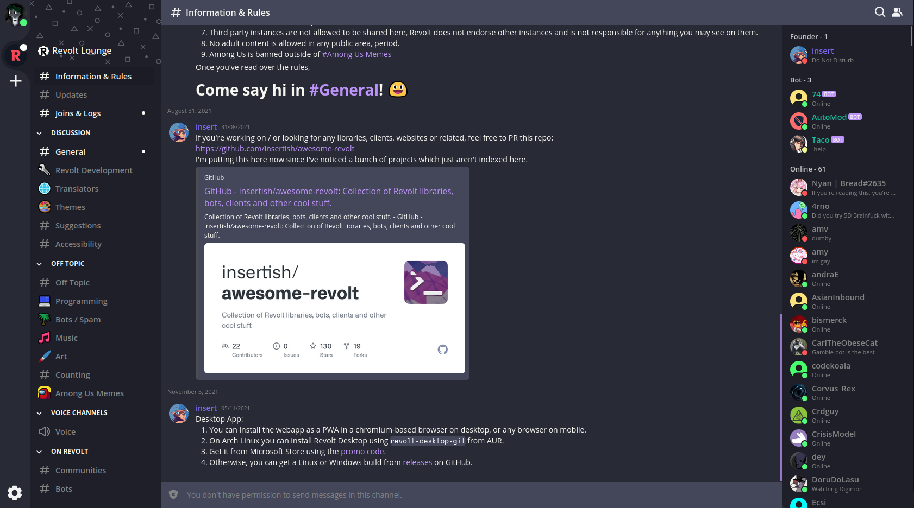
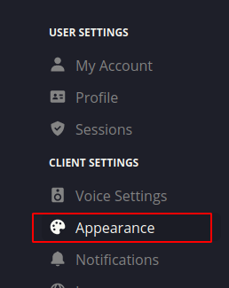
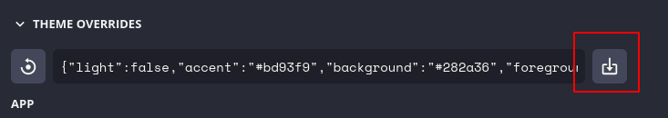

# Dracula for [Revolt](https://revolt.chat)

> A dark theme for [Revolt](https://revolt.chat).

## Install

1.Open https://app.revolt.chat in your Browser
2.Klick on the Settings Button
3.Klick on Apperiance

5.Klick on "Import a Theme"

6. Paste this code:
`{"light":false,"accent":"#bd93f9","background":"#282a36","foreground":"#f8f8f2","block":"#44475a","message-box":"#44475a","mention":"#ff5555","success":"#65E572","warning":"#ffb86c","error":"#ff5555","hover":"rgba(0, 0, 0, 0.1)","scrollbar-thumb":"#9776c7","scrollbar-track":"transparent","primary-background":"#282a36","primary-header":"#44475a","secondary-background":"#1E1F29","secondary-foreground":"#f3f3f3","secondary-header":"#44475a","tertiary-background":"#4D4D4D","tertiary-foreground":"#848484","status-online":"#50fa7b","status-away":"#f1fa8c","status-busy":"#ff5555","status-streaming":" #bd93f9","status-invisible":" #6272a4","monospaceFont":"Space Mono","css":""}`
